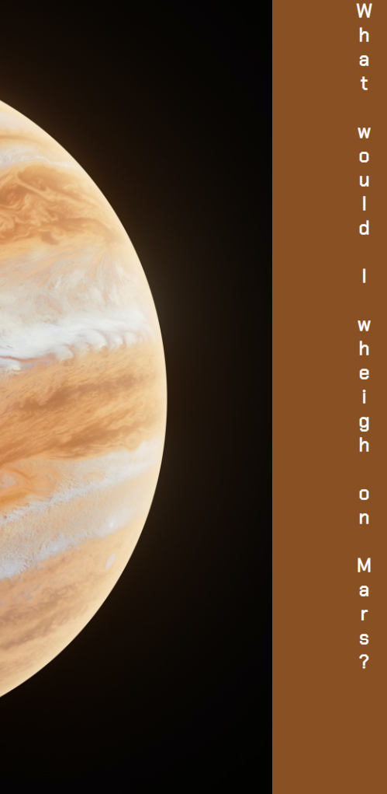
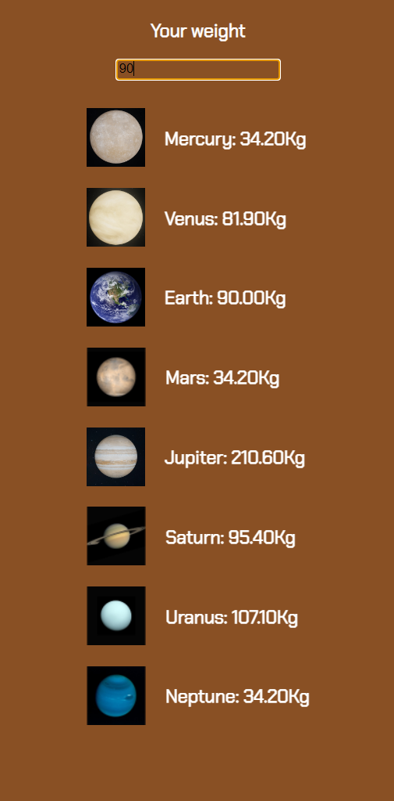

## Table of contents

- [Overview](#overview)
  - [Screenshot](#screenshot)
  - [Links](#links)
- [My process](#my-process)
  - [Built with](#built-with)
  - [What I learned](#what-i-learned)
- [Author](#author)
- [Acknowledgments](#acknowledgments)

## Overview

Simple website calculating relative weight to earth, on each planet of the solar system.

### Screenshot

### Links

- Live Site URL: Not yet available

## My process
I put the design together in in this Figma file: https://www.figma.com/file/0SDzdgf1bvwfC5TM45VjoX/Untitled?type=design&node-id=5%3A15&mode=design&t=03lZQN1gUGcXgCJQ-1. Then I put the diferrent elements into fitting HTML tags, and started styling it, for mobile only.

### Built with

- Semantic HTML5 markup
- CSS custom properties
- Flexbox
- Mobile-first workflow

### What I learned

The planets order in the solar system.

## Author

- Website - [havardekodehode]("portfolioSite")

## Acknowledgments

Thanks to Harisha, who assigned this task.
